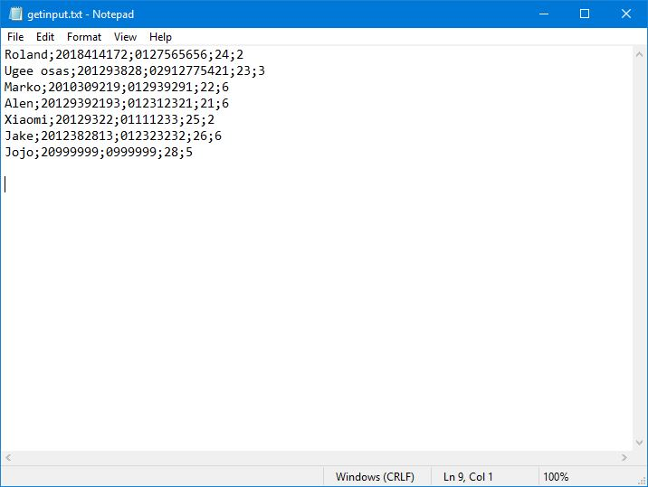
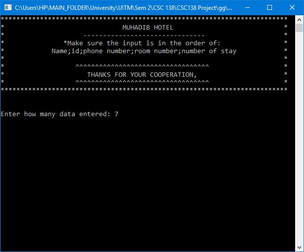
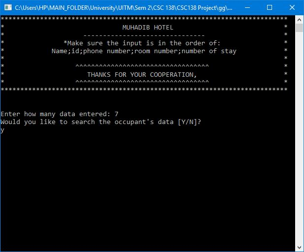
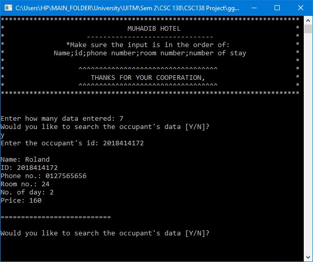
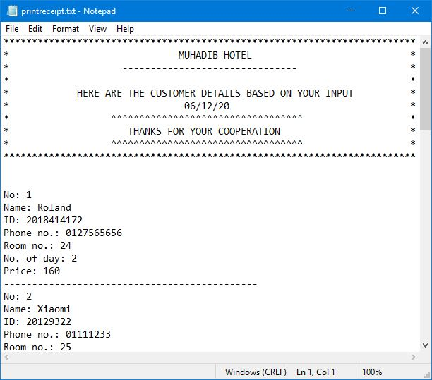
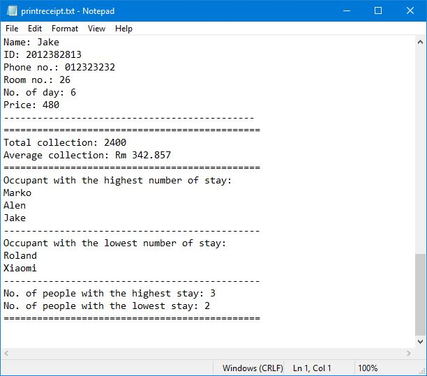

# Hotel-Reservation-System-v1
A simple Hotel Reservation System made with C++.

# How to use
1. Enter your input in getinput.txt with the following format:
   <Name;ID;Phone no.;Room ID, Number of Stay>
   
   
   
2. Run HotelReservationSystem.exe and enter how many input in your getinput.txt.
   

3. The program will prompt you to enter y/n to search for occupant's data.
   
   
   
4. If you enter y, enter the occupant's id and the program will display the data of the occupant.
   
   
   
5. Enter n to stop the program.

6. The program will generate/overwrite printreceipt.txt file with the formatted input and some report for the data entered.
   
   
